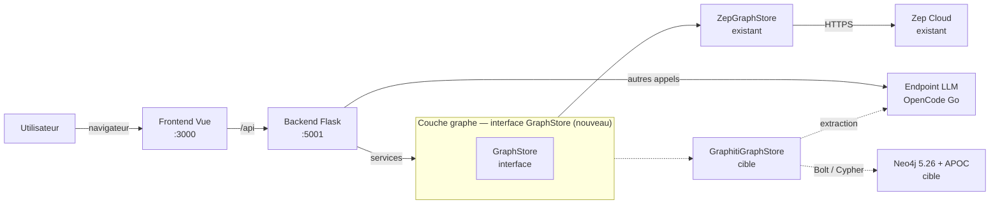
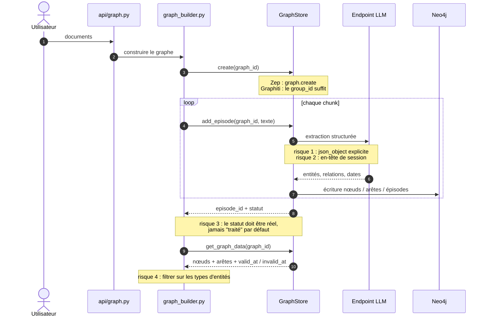

# Architecture cible — la couche graphe

Deux vues, deux questions distinctes. Les schémas distinguent l'**existant
observé** (trait plein), la **cible proposée** (pointillés) et les
**hypothèses** (« À confirmer »). Aucune couleur personnalisée n'est utilisée :
le thème par défaut de Mermaid suffit et évite tout enjeu de contraste.

Décision associée : [ADR 0001](../decisions/0001-remplacement-de-zep-par-graphiti.md) ·
ADR 0003 (ontologie en v2).

---

## Vue 1 — Conteneurs : ce qui change

**Question** — où passe la frontière entre le métier et le graphe, et qu'est-ce
qui change concrètement quand on remplace Zep par Graphiti ?

**Portée** — backend uniquement. Le frontend ne parle pas au graphe.

**Sources** — `backend/app/api/{graph,simulation}.py`,
`backend/app/services/graph_builder.py`, `backend/app/utils/zep.py`,
`backend/app/config.py`, `backend/pyproject.toml`.

**Implémentations concrètes**

- `GraphStore` est l'unique porte d'entrée : les services ne connaissent plus
  `zep.py`. C'est la discipline qui rend la bascule possible sans réécrire les
  services.
- `ZEP_BACKEND=cloud|graphiti` choisit l'implémentation **une seule fois**, à
  la construction — jamais dans un `if` au milieu d'un service.
- Les deux implémentations doivent exposer le même contrat : nœuds, arêtes
  **avec leurs dates**, recherche hybride, création/suppression de graphe.

**À confirmer**

- Le contrat exact de l'interface : on le fige après avoir vu les ~16 points
  d'entrée Zep réellement utilisés, pas avant.

---

## Vue 2 — Séquence : construction d'un graphe

**Question** — que se passe-t-il pendant la construction, et où sont les points
de rupture ?

**Portée** — de l'upload du document à la lecture du graphe par les personas.
Pendant les tours de simulation, le graphe n'est **qu'écrit**, pas lu par les
agents (`docs/LOCAL-FIRST.md` §3).

**Sources** — `backend/app/services/graph_builder.py`,
`zep_graph_memory_updater.py`, `zep_entity_reader.py`,
`oasis_profile_generator.py`, `backend/app/utils/zep_paging.py`.

**Les quatre points de rupture, au même endroit**

1. **Structured output** — Graphiti dépend du JSON structuré. Il faut
   `structured_output_mode="json_object"` explicite, sinon l'extraction échoue
   silencieusement ou bruyamment selon le modèle.
2. **En-tête de session** — le client LLM de Graphiti n'envoie ni session ni
   user-agent : à couvrir en sous-classant `OpenAIGenericClient`.
3. **Statut d'épisode** — le build doit savoir si l'extraction a réellement
   eu lieu. Un statut toujours « traité » masque toutes les pannes.
4. **Filtrage des entités** — `zep_entity_reader.py:262` ignore tout nœud dont
   les labels ne dépassent pas `{Entity, Node}`. Sans ontologie custom
   (ADR 0003), Graphiti ne met que `Entity` : **tout est filtré**. Le chemin de
   lecture doit donc définir explicitement ce qu'est une entité exploitable.

**À confirmer**

- Le comportement du reranker sur cet endpoint (les logprobs sont probablement
  absents → repli RRF, comme Zep le fait déjà).
- La résistance du driver Neo4j au conflit de versions avec `camel-oasis`.