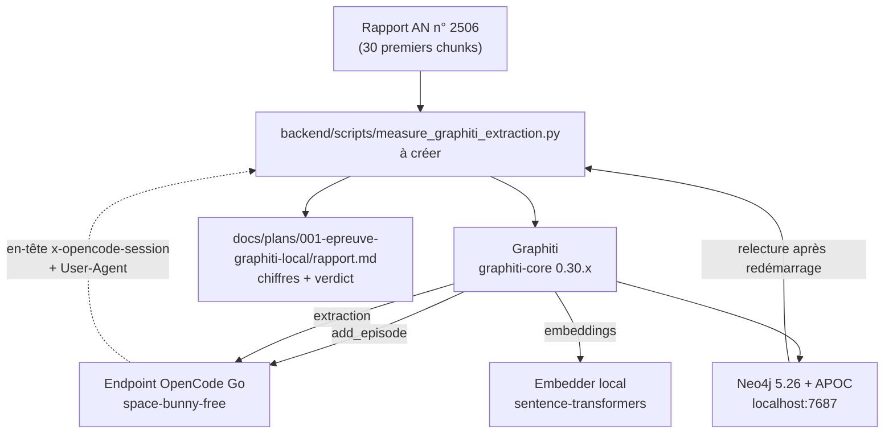

# Epic 001 — Architecture de l'épreuve

- **Question** — comment mesurer l'extraction de Graphiti avec notre endpoint
  LLM, sans toucher au code de production ?
- **Statut du projet** : in-progress · **PRD** : [`prd.md`](prd.md)
- **Schéma global du graphe** : [`docs/architecture/cible-graphstore.md`](../../architecture/cible-graphstore.md)

Les signatures exactes des classes `graphiti-core` **ne sont pas confirmées** :
elles changent entre versions. Ce qui suit est le **squelette**, avec les points
à vérifier explicitement.

---

## Vue



Tout est dans **un script** : on ne touche à aucun service. C'est ce qui rend
l'épreuve sans risque.

## 1. Le point technique clé : le client LLM de Graphiti

`graphiti-core` appelle **son propre** client LLM. Il ne voit pas
`backend/app/utils/llm_compat.py`, donc il n'enverra ni `x-opencode-session`
ni User-Agent → `MissingSessionID` dès le premier appel (critère C2).

Squelette de la sous-classe — **à confirmer sur 0.30.2** : la méthode à
surcharger a changé entre versions.

```python
from graphiti_core.llm_client.openai_generic_client import OpenAIGenericClient

class MiroFishLLMClient(OpenAIGenericClient):
    """Graphiti n'appelle pas notre client : il faut le lui donner."""

    # ⚠️ signature à vérifier sur la version installée
    async def _llm_request(self, messages, **kwargs):
        headers = llm_request_headers(self.config.base_url)  # utils/llm_compat.py
        ...
```

> Si aucune méthode d'injection d'en-têtes n'existe, deux solution de repli :
> un proxy local qui ajoute l'en-tête, ou une sous-classe du client HTTP
> sous-jacent.

## 2. Configuration minimale de Graphiti

```python
from graphiti_core import Graphiti
from graphiti_core.llm_client.config import LLMConfig

llm_config = LLMConfig(
    api_key=...,                 # OPENAI_API_KEY, mappé depuis LLM_API_KEY
    base_url=...,                # https://opencode.ai/zen/go/v1
    model="space-bunny-free",
    temperature=0,
    max_tokens=8192,
    # structured_output_mode="json_object",   # ⚠️ champ à confirmer sur 0.30.x
)
```

`SEMAPHORE_LIMIT` : à fixer **bas** (2 ou 3). Un endpoint gratuit surveillé
maltraite le trafic parallèle.

## 3. Embedder local

`sentence-transformers==3.0.0` et `torch==2.9.1` sont déjà dans le venv
(dépendance de `camel-oasis`). Un embedder local évite les appels API, la
collision de dimensions et le chunking.

> ⚠️ **Correction du 3 octobre 2026 (story 001-1).** La phrase ci-dessus était
> vraie mais trompeuse : « déjà dans le venv » ne veut pas dire « installable ».
> `camel-oasis` **épingle** `sentence-transformers==3.0.0`, et l'extra
> `graphiti-core[sentence-transformers]` exige `>=3.2.1` — même forme de conflit
> que `neo4j` (`5.23.0` épinglé par `camel-oasis` contre le plancher `>=5.26.0`
> exigé par Graphiti). L'extra est **ininstallable** sans arbitrage. La story
> 001-4 devra trancher — avec un `override-dependencies` comme pour le driver,
> ou en acceptant un embedder moins récent : un saut `sentence-transformers`
> 3.0 → 3.2 est un changement de modèle et de `torch`, il ne se décide pas par
> analogie avec un driver. Mesuré et consigné dans
> [`story-001-1.md`](story-001-1.md) et
> [ADR 0011](../../decisions/0011-inventaire-driver-et-format-de-story.md).

```python
from graphiti_core.embedder.sentence_transformer import (
    SentenceTransformerEmbedderConfig, SentenceTransformerEmbedder,
)
```

## 4. Neo4j

Le compose ci-dessous est **le squelette de départ** ; il est écrit et mesuré
depuis. Le compose réel est [`docker-compose.neo4j.yml`](../../../docker-compose.neo4j.yml)
— **séparé** de `docker-compose.yml`, qui pointe l'image amont (AGENTS.md §2.9).

```yaml
services:
  neo4j:
    image: neo4j:5.26            # ⚠️ voir les corrections du 5 octobre ci-dessous
    ports: ["7474:7474", "7687:7687"]
    environment:
      NEO4J_AUTH: neo4j/<mot-de-passe>
      NEO4J_PLUGINS: '["apoc"]'
    volumes: [neo4j_data:/data]
volumes:
  neo4j_data:
```

**Critère C3 impose de redémarrer Neo4j** et de relire : une extraction qui ne
survit pas au redémarrage n'est pas une preuve. → **mesuré, le 5 octobre 2026**
(story 001-2) : `stop` puis `start`, et le nœud est relu avec son arête et son
`valid_at`.

### Corrections du 5 octobre 2026 (story 001-2)

**Le tag `neo4j:5.26` est flottant, et le squelette ci-dessus est faux.** Vérifié
sur Docker Hub le 5 octobre : `5.26` pointe sur `5.26.31`, et il bouge à chaque
sortie. Le tag livré est **`neo4j:5.26.31-community`** :

- **patch figé**, pour qu'un `up` six mois après démarre le serveur qu'on a
  mesuré — même raisonnement que la version résolue de l'override, consignée à
  côté dans `pyproject.toml` (ADR 0011) ;
- **`-community`**, parce que `neo4j:<version>` sans suffixe est l'édition
  **Enterprise**, qui réclame un accord de licence. NFR-1 vaut 0 €.

**APOC n'est pas là pour Graphiti.** Ce squelette le prescrit parce que le fork
de référence l'avait, sans dire pourquoi. Mesuré :

- **`graphiti-core==0.30.2` s'en passe** — zéro occurrence de `apoc` dans le
  paquet, et sur un serveur sans plugin ses 31 requêtes d'indexation, ses
  procédures vectorielles et sa recherche fulltext passent toutes ;
- **`camel-oasis` en a besoin** — `Neo4jGraph.__init__` appelle
  `refresh_schema()`, qui exécute `CALL apoc.meta.data()`, et `add_nodes_from_df`
  utilise `apoc.merge.node`, `apoc.merge.relationship` et
  `apoc.create.addLabels`. Sans plugin, le chemin Neo4j de `camel` casse dès le
  premier appel, avec un message qui accuse une installation manquante.

Le plugin **reste donc**, pour `camel` et non pour Graphiti. Et il faut
`NEO4J_dbms_security_procedures_unrestricted: "apoc.*"` : `apoc.merge.*` est une
procédure d'écriture, refusée par défaut même plugin installé.

**L'écart driver / serveur est mesuré, pas présumé.** `neo4j 5.28.6` (locké par
l'override de l'ADR 0010) contre `Neo4j 5.26.31`. Il tient : écriture, relecture
après redémarrage, surface de l'ADR 0011 entière — 17/17 contrôles, deux fois.
Un test garde l'écart, pour que le jour où quelqu'un aligne les deux « pour
simplifier », ce soit un geste visible.

**Un écart que personne n'attendait : `CALL db.indexes()` n'existe pas** sur un
serveur 5.x. `graphiti-core` l'appelle dans `delete_all_indexes`, donc par
`build_indices_and_constraints(delete_existing=True)` — **hors du chemin
d'écriture d'épisodes**. La 001-5 doit le savoir avant de choisir sa remise à
zéro.

## 5. Ordre d'exécution

1. `uv lock && uv sync` après ajout de `graphiti-core` → puis `uv run pytest`
   pour vérifier que `camel-oasis` n'a pas cassé (story 001-1)
   → ⚠️ **fait, et ça ne passe pas tel quel** : `camel-oasis==0.2.5` épingle
   `neo4j==5.23.0`, `graphiti-core` exige `>=5.26.0`. Il faut l'`override`
   décrit dans [`story-001-1.md`](story-001-1.md) — **décidé par l'ADR 0010,
   précisé par l'ADR 0011** — et c'est la story
   [001-1b](story-001-1b.md) qui le pose. Attention : `graphiti-core` **sans
   extra**. L'extra `sentence-transformers` déclencherait le second conflit et
   reviendrait à trancher la 001-4 par la porte de derrière.
2. Neo4j up, healthcheck vert (001-2)
   → ✅ **fait, le 5 octobre 2026** : compose d'épreuve séparé, tag figé
   `5.26.31-community`, healthcheck qui interroge le Bolt, volume nommé. Le
   driver forcé **tient** — voir §4 et
   [`story-001-2.md`](story-001-2.md)
3. Script de mesure sur 1 chunk → vérifier l'auth **avant** d'aller plus loin
   (001-3)
4. Embedder local branché (001-4)
5. Mesure sur 30 chunks, rapport versionné (001-5)
6. Verdict go / no-go (001-6)

## 6. Journal de mesure

Un seul fichier, versionné : [`rapport.md`](rapport.md) — chiffres bruts,
journal des échecs (le message d'erreur exact est la donnée la plus utile),
verdict. Les critères sont ceux du [`prd.md`](prd.md), sans renégociation à la
relecture.