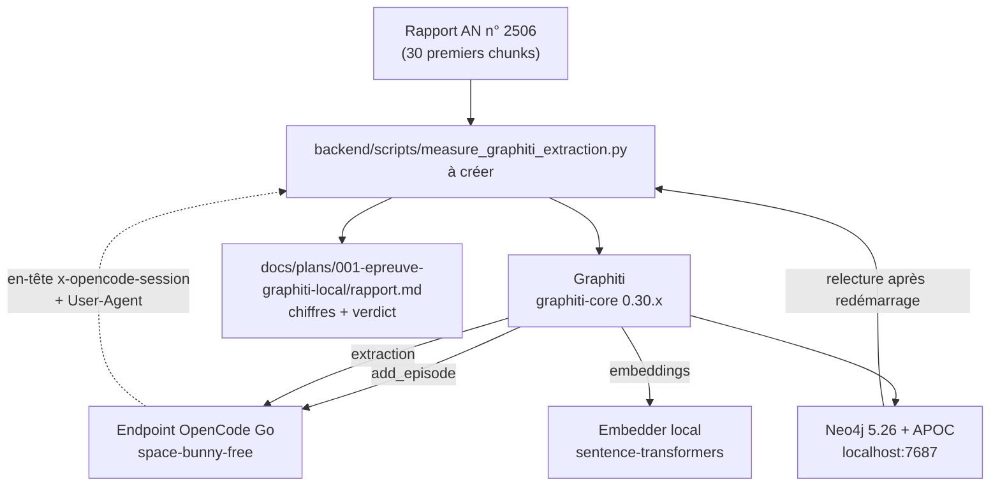

# Epic 001 — Architecture de l'épreuve

- **Question** — comment mesurer l'extraction de Graphiti avec notre endpoint
  LLM, sans toucher au code de production ?
- **Statut du projet** : in-progress · **PRD** : [`prd.md`](prd.md)
- **Schéma global du graphe** : [`docs/architecture/cible-graphstore.md`](../../architecture/cible-graphstore.md)

Les signatures exactes des classes `graphiti-core` **ne sont pas confirmées** :
elles changent entre versions. Ce qui suit est le **squelette**, avec les points
à vérifier explicitement.

---

## Vue



Tout est dans **un script** : on ne touche à aucun service. C'est ce qui rend
l'épreuve sans risque.

## 1. Le point technique clé : le client LLM de Graphiti

`graphiti-core` appelle **son propre** client LLM. Il ne voit pas
`backend/app/utils/llm_compat.py`, donc il n'enverra ni `x-opencode-session`
ni User-Agent → `MissingSessionID` dès le premier appel (critère C2).

Squelette de la sous-classe — **à confirmer sur 0.30.2** : la méthode à
surcharger a changé entre versions.

```python
from graphiti_core.llm_client.openai_generic_client import OpenAIGenericClient

class MiroFishLLMClient(OpenAIGenericClient):
    """Graphiti n'appelle pas notre client : il faut le lui donner."""

    # ⚠️ signature à vérifier sur la version installée
    async def _llm_request(self, messages, **kwargs):
        headers = llm_request_headers(self.config.base_url)  # utils/llm_compat.py
        ...
```

> Si aucune méthode d'injection d'en-têtes n'existe, deux solution de repli :
> un proxy local qui ajoute l'en-tête, ou une sous-classe du client HTTP
> sous-jacent.

## 2. Configuration minimale de Graphiti

```python
from graphiti_core import Graphiti
from graphiti_core.llm_client.config import LLMConfig

llm_config = LLMConfig(
    api_key=...,                 # OPENAI_API_KEY, mappé depuis LLM_API_KEY
    base_url=...,                # https://opencode.ai/zen/go/v1
    model="space-bunny-free",
    temperature=0,
    max_tokens=8192,
    # structured_output_mode="json_object",   # ⚠️ champ à confirmer sur 0.30.x
)
```

`SEMAPHORE_LIMIT` : à fixer **bas** (2 ou 3). Un endpoint gratuit surveillé
maltraite le trafic parallèle.

## 3. Embedder local

`sentence-transformers==3.0.0` et `torch==2.9.1` sont déjà dans le venv
(dépendance de `camel-ai`). Un embedder local évite les appels API, la
collision de dimensions et le chunking.

```python
from graphiti_core.embedder.sentence_transformer import (
    SentenceTransformerEmbedderConfig, SentenceTransformerEmbedder,
)
```

## 4. Neo4j

Reprendre le compose du fork de référence, nettoyé (le `version:` est obsolète,
le mot de passe est en dur) :

```yaml
services:
  neo4j:
    image: neo4j:5.26
    ports: ["7474:7474", "7687:7687"]
    environment:
      NEO4J_AUTH: neo4j/<mot-de-passe>
      NEO4J_PLUGINS: '["apoc"]'
    volumes: [neo4j_data:/data]
volumes:
  neo4j_data:
```

**Critère C3 impose de redémarrer Neo4j** et de relire : une extraction qui ne
survit pas au redémarrage n'est pas une preuve.

## 5. Ordre d'exécution

1. `uv lock && uv sync` après ajout de `graphiti-core` → puis `uv run pytest`
   pour vérifier que `camel-oasis` n'a pas cassé (story 001-1)
2. Neo4j up, healthcheck vert (001-2)
3. Script de mesure sur 1 chunk → vérifier l'auth **avant** d'aller plus loin
   (001-3)
4. Embedder local branché (001-4)
5. Mesure sur 30 chunks, rapport versionné (001-5)
6. Verdict go / no-go (001-6)

## 6. Journal de mesure

Un seul fichier, versionné : [`rapport.md`](rapport.md) — chiffres bruts,
journal des échecs (le message d'erreur exact est la donnée la plus utile),
verdict. Les critères sont ceux du [`prd.md`](prd.md), sans renégociation à la
relecture.