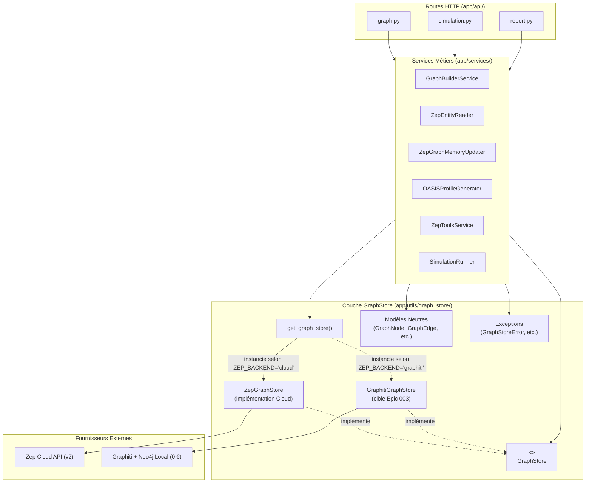
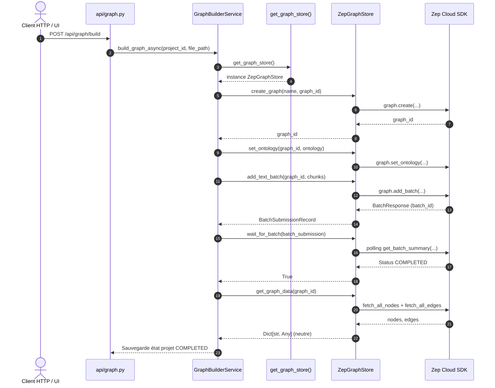

# Epic 002 — Architecture de l'interface GraphStore

- **Statut** : `in-progress` · **PRD** : [`prd.md`](prd.md)
- **Décisions associées** : [ADR 0001](../../decisions/0001-remplacement-de-zep-par-graphiti.md) · [ADR 0003](../../decisions/0003-ontologie-differee-en-v2.md)
- **Schéma cible global** : [`docs/architecture/cible-graphstore.md`](../../architecture/cible-graphstore.md)

---

## 1. Vue d'ensemble architecturale

L'objectif architectural fondamental de l'Epic 002 est l'application stricte du principe
d'inversion des dépendances (DIP / SOLID) et de Clean Architecture (AGENTS.md §2.1) :
les services applicatifs et routes HTTP ne doivent plus dépendre de détails d'infrastructure
ou de SDK tiers propriétaires (`zep-cloud`), mais d'une abstraction stable et neutre.



### Organisation des modules dans le dépôt

Conformément à la constitution (AGENTS.md §2.1 : `api → services → utils`, aucune dépendance circulaire),
la couche `GraphStore` est un composant d'infrastructure technique logé dans `backend/app/utils/graph_store/` :

```
backend/app/utils/graph_store/
├── __init__.py          # Exports publics : GraphStore, get_graph_store, modèles, exceptions
├── base.py              # Interface abstraite GraphStore (ABC) & Dataclasses neutres
├── errors.py            # Hiérarchie d'exceptions agnostiques (GraphStoreError, etc.)
├── zep_store.py         # Implémentation concrète ZepGraphStore
└── factory.py           # Factory get_graph_store() et helper d'override pour tests
```

---

## 2. Modèles de données neutres (`base.py`)

Pour éliminer toute fuite de types Zep (`EntityNode`, `ZepEdge`, `BatchAddItem`, etc.) dans
le domaine applicatif MiroFish, des structures de données neutres et immutables sont posées :

```python
from dataclasses import dataclass, field
from typing import Any, Dict, List, Optional, Set


@dataclass(frozen=True)
class GraphNode:
    """Nœud de graphe de connaissances agnostique."""
    uuid: str
    name: str
    labels: List[str] = field(default_factory=list)
    summary: str = ""
    attributes: Dict[str, Any] = field(default_factory=dict)
    created_at: Optional[str] = None
    related_edges: List[Dict[str, Any]] = field(default_factory=list)
    related_nodes: List[Dict[str, Any]] = field(default_factory=list)

    def to_dict(self) -> Dict[str, Any]:
        return {
            "uuid": self.uuid,
            "name": self.name,
            "labels": list(self.labels),
            "summary": self.summary,
            "attributes": dict(self.attributes),
            "created_at": self.created_at,
            "related_edges": list(self.related_edges),
            "related_nodes": list(self.related_nodes),
        }

    def get_entity_type(self) -> Optional[str]:
        """Retourne le type d'entité spécifique (hors Entity/Node génériques)."""
        for label in self.labels:
            if label not in ["Entity", "Node"]:
                return label
        return None


@dataclass(frozen=True)
class GraphEdge:
    """Arête de relation temporelle entre deux nœuds."""
    uuid: str
    name: str
    fact: str
    source_node_uuid: str
    target_node_uuid: str
    fact_type: str = ""
    source_node_name: str = ""
    target_node_name: str = ""
    attributes: Dict[str, Any] = field(default_factory=dict)
    created_at: Optional[str] = None
    valid_at: Optional[str] = None
    invalid_at: Optional[str] = None
    expired_at: Optional[str] = None
    episodes: List[str] = field(default_factory=list)

    def to_dict(self, include_temporal: bool = True) -> Dict[str, Any]:
        data = {
            "uuid": self.uuid,
            "name": self.name,
            "fact": self.fact,
            "fact_type": self.fact_type,
            "source_node_uuid": self.source_node_uuid,
            "target_node_uuid": self.target_node_uuid,
            "source_node_name": self.source_node_name,
            "target_node_name": self.target_node_name,
            "attributes": dict(self.attributes),
            "episodes": list(self.episodes),
        }
        if include_temporal:
            data.update({
                "created_at": self.created_at,
                "valid_at": self.valid_at,
                "invalid_at": self.invalid_at,
                "expired_at": self.expired_at,
            })
        return data

    def is_expired(self) -> bool:
        return self.expired_at is not None

    def is_invalid(self) -> bool:
        return self.invalid_at is not None


@dataclass(frozen=True)
class GraphSearchResult:
    """Résultat unifié d'une recherche sémantique ou hybride."""
    facts: List[str]
    nodes: List[GraphNode]
    edges: List[GraphEdge]
    query: str
    total_count: int

    def to_dict(self) -> Dict[str, Any]:
        return {
            "facts": list(self.facts),
            "nodes": [n.to_dict() for n in self.nodes],
            "edges": [e.to_dict() for e in self.edges],
            "query": self.query,
            "total_count": self.total_count,
        }

    def to_text(self) -> str:
        """Format textuel lisible pour injection dans les prompts LLM."""
        parts = [f"Requête : {self.query}", f"{self.total_count} élément(s) pertinent(s)"]
        if self.facts:
            parts.append("\n### Faits extraits :")
            for idx, fact in enumerate(self.facts, 1):
                parts.append(f"{idx}. {fact}")
        return "\n".join(parts)


@dataclass(frozen=True)
class EpisodeRecord:
    """Enregistrement d'un épisode textuel ingéré."""
    uuid: str
    graph_id: str
    processed: bool = False
    created_at: Optional[str] = None

    def to_dict(self) -> Dict[str, Any]:
        return {
            "uuid": self.uuid,
            "graph_id": self.graph_id,
            "processed": self.processed,
            "created_at": self.created_at,
        }


@dataclass(frozen=True)
class BatchSubmissionRecord:
    """Identité durable d'une opération d'ingestion par lots."""
    batch_id: str
    operation_id: str
    episode_uuids: List[str]
    item_count: int

    def to_dict(self) -> Dict[str, Any]:
        return {
            "batch_id": self.batch_id,
            "operation_id": self.operation_id,
            "episode_uuids": list(self.episode_uuids),
            "item_count": self.item_count,
        }


@dataclass(frozen=True)
class GraphInfo:
    """Statistiques et métadonnées globales d'un graphe."""
    graph_id: str
    node_count: int
    edge_count: int
    entity_types: List[str] = field(default_factory=list)

    def to_dict(self) -> Dict[str, Any]:
        return {
            "graph_id": self.graph_id,
            "node_count": self.node_count,
            "edge_count": self.edge_count,
            "entity_types": list(self.entity_types),
        }
```

---

## 3. Contrat d'interface formel (`GraphStore`)

L'interface est une classe abstraite pure (`abc.ABC`) couvrant 100 % des opérations réelles
recensées dans MiroFish :

```python
from abc import ABC, abstractmethod
from typing import Any, Callable, Dict, List, Optional


class GraphStore(ABC):
    """Interface unifiée pour le magasin de graphe de connaissances temporel."""

    # --- Cycle de vie ---

    @abstractmethod
    def create_graph(self, name: str, graph_id: Optional[str] = None) -> str:
        """Crée un graphe et retourne son identifiant durable."""
        pass

    @abstractmethod
    def delete_graph(self, graph_id: str) -> None:
        """Supprime un graphe et l'ensemble de ses données associées."""
        pass

    @abstractmethod
    def get_graph_data(self, graph_id: str) -> Dict[str, Any]:
        """Retourne les nœuds, arêtes et statistiques complètes du graphe pour l'API."""
        pass

    @abstractmethod
    def get_graph_info(self, graph_id: str) -> GraphInfo:
        """Retourne un résumé synthétique (comptages et types d'entités)."""
        pass

    # --- Ontologie ---

    @abstractmethod
    def set_ontology(self, graph_id: str, ontology: Dict[str, Any]) -> None:
        """Définit ou synchronise l'ontologie des types d'entités du graphe."""
        pass

    # --- Ingestion et épisodes ---

    @abstractmethod
    def add_episode(
        self,
        graph_id: str,
        text: str,
        source_description: str = "",
        metadata: Optional[Dict[str, Any]] = None,
        created_at: Optional[str] = None,
    ) -> EpisodeRecord:
        """Ajoute un épisode textuel unitaire au graphe."""
        pass

    @abstractmethod
    def add_text_batch(
        self,
        graph_id: str,
        chunks: List[str],
        batch_size: int = 350,
        progress_callback: Optional[Callable[[str, int, int], None]] = None,
    ) -> BatchSubmissionRecord:
        """Ingère une liste de textes découpés par lots."""
        pass

    @abstractmethod
    def wait_for_batch(
        self,
        batch: BatchSubmissionRecord,
        progress_callback: Optional[Callable[[str, float], None]] = None,
        timeout: float = 600.0,
    ) -> bool:
        """Attend la fin du traitement asynchrone d'un lot d'ingestion."""
        pass

    @abstractmethod
    def wait_for_episodes(
        self,
        graph_id: str,
        episode_uuids: List[str],
        timeout: float = 600.0,
    ) -> bool:
        """Attend la fin du traitement pour une liste explicite d'épisodes."""
        pass

    # --- Lecture et parcours ---

    @abstractmethod
    def get_all_nodes(self, graph_id: str) -> List[GraphNode]:
        """Récupère tous les nœuds d'un graphe."""
        pass

    @abstractmethod
    def get_all_edges(self, graph_id: str, include_temporal: bool = True) -> List[GraphEdge]:
        """Récupère toutes les arêtes d'un graphe avec ou sans champs temporels."""
        pass

    @abstractmethod
    def get_node(self, graph_id: str, node_uuid: str) -> Optional[GraphNode]:
        """Récupère un nœud spécifique par son identifiant unique."""
        pass

    @abstractmethod
    def get_node_edges(self, graph_id: str, node_uuid: str) -> List[GraphEdge]:
        """Récupère toutes les arêtes connectées à un nœud (entrantes et sortantes)."""
        pass

    # --- Recherche ---

    @abstractmethod
    def search(
        self,
        graph_id: str,
        query: str,
        limit: int = 10,
        scope: str = "edges",
    ) -> GraphSearchResult:
        """Effectue une recherche sémantique / hybride sur les arêtes ou les nœuds."""
        pass
```

---

## 4. Hiérarchie d'exceptions unifiée (`errors.py`)

Les services applicatifs ne doivent capturer aucune exception issue du SDK propriétaire `zep-cloud`.
Une hiérarchie dédiée et agnostique est posée :

```python
class GraphStoreError(Exception):
    """Erreur de base pour toutes les opérations sur le magasin de graphe."""
    pass


class GraphNotFoundError(GraphStoreError):
    """Levée lorsqu'un graphe, un nœud ou une ressource demandée n'existe pas."""
    pass


class GraphConnectionError(GraphStoreError):
    """Levée lors d'un échec réseau ou d'indisponibilité du service distant/local."""
    pass


class GraphTimeoutError(GraphStoreError):
    """Levée lors de l'expiration du délai d'attente d'ingestion ou de requête."""
    pass


class GraphValidationError(GraphStoreError):
    """Levée lorsque les paramètres fournis au magasin de graphe sont invalides."""
    pass
```

### Table de correspondance des exceptions dans `ZepGraphStore`

| Exception levée par `zep-cloud` / `httpx` | Traduction dans `ZepGraphStore` |
|---|---|
| `zep_cloud.NotFoundError` | `GraphNotFoundError` |
| `zep_cloud.core.api_error.ApiError` (404) | `GraphNotFoundError` |
| `zep_cloud.core.api_error.ApiError` (502, 503, 504) | `GraphConnectionError` |
| `httpx.ConnectError`, `httpx.NetworkError` | `GraphConnectionError` |
| `httpx.TimeoutException`, délai d'attente dépassé | `GraphTimeoutError` |
| Autre `ApiError` ou erreur inattendue | `GraphStoreError` |

---

## 5. La Factory `get_graph_store()` (`factory.py`)

La factory est l'unique point de décision architectural pour l'instanciation du store :

```python
import os
from contextlib import contextmanager
from typing import Optional
from ...config import Config
from .base import GraphStore
from .errors import GraphValidationError
from .zep_store import ZepGraphStore

_store_override: Optional[GraphStore] = None


def set_graph_store_override(store: Optional[GraphStore]) -> None:
    """Permet aux tests unitaires d'injecter un faux store en mémoire."""
    global _store_override
    _store_override = store


@contextmanager
def override_graph_store(store: GraphStore):
    """Gestionnaire de contexte pour isoler l'injection d'un store pendant un test."""
    old_override = _store_override
    set_graph_store_override(store)
    try:
        yield store
    finally:
        set_graph_store_override(old_override)


def get_graph_store(
    backend: Optional[str] = None,
    api_key: Optional[str] = None,
) -> GraphStore:
    """Retourne l'instance concrète du GraphStore configuré."""
    if _store_override is not None:
        return _store_override

    selected_backend = (
        backend or getattr(Config, "ZEP_BACKEND", None) or os.environ.get("ZEP_BACKEND") or "cloud"
    ).lower().strip()

    if selected_backend == "cloud":
        return ZepGraphStore(api_key=api_key)
    elif selected_backend == "graphiti":
        raise NotImplementedError(
            "Le backend 'graphiti' (GraphitiGraphStore) fait l'objet de l'Epic 003."
        )
    else:
        raise GraphValidationError(
            f"Backend de graphe non supporté : '{selected_backend}'. Valeurs autorisées : 'cloud', 'graphiti'."
        )
```

- **Sécurité et défaut strict** : `cloud` par défaut, préservant 100 % du comportement actuel.
- **Règle absolue** : Zéro bifurcation `if zep else graphiti` en dehors de cette fonction (AGENTS.md §2.1).
- **Testabilité** : L'injection via `set_graph_store_override` permet d'exécuter tous les tests métiers sans aucun appel réseau.

---

## 6. Flux de traitement et séquences

### Séquence de construction de graphe (ingestion)



---

## 7. Plan de migration des 10 composants consommateurs

La migration est découpée de manière à garantir que les **333 tests existants restent verts à chaque commit** :

| Étape | Fichier cible | Nature de la modification | Impact / Sécurité |
|---|---|---|---|
| **Étape 1** | `app/utils/graph_store/` | Création de `base.py`, `errors.py`, `zep_store.py`, `factory.py` | Nouveau module, 0 impact sur l'existant |
| **Étape 2** | `app/services/graph_builder.py` | Remplacer `self.client = get_zep_client(...)` par `self.store = get_graph_store(...)` ; déléguer création, batch, ontologie, données | `BatchSubmission` utilise `BatchSubmissionRecord` ; imports `zep_cloud` supprimés |
| **Étape 3** | `app/services/zep_graph_memory_updater.py` | Utiliser `self.store.add_episode(...)` et `self.store.wait_for_episodes(...)` | Suppression de l'appel direct `client.graph.add(...)` |
| **Étape 4** | `app/services/simulation_runner.py` | Remplacer les imports de timeouts `utils.zep` par des constantes ou timeouts du store | Découplage de `simulation_runner` vis-à-vis de Zep |
| **Étape 5** | `app/services/zep_entity_reader.py` | Déléguer `get_all_nodes`, `get_all_edges`, `get_node_edges` à `self.store` | `EntityNode` s'appuie sur `GraphNode` sans casser ses attributs d'API |
| **Étape 6** | `app/services/oasis_profile_generator.py` | Remplacer `self.zep_client.graph.search(...)` par `self.store.search(...)` | Suppression de `get_zep_client` et des retries ad-hoc |
| **Étape 7** | `app/services/zep_tools.py` | Utiliser `self.store.search`, `get_all_nodes`, `get_all_edges`, `get_node` | Suppression de `NotFoundError` direct et des imports `zep_cloud` |
| **Étape 8** | `app/api/graph.py` | Utiliser `GraphNotFoundError` au lieu de `zep_cloud.NotFoundError` ; déléguer les actions via le store | **0** import `zep_cloud` dans les routes API |
| **Étape 9** | `backend/tests/test_graph_store_isolation.py` | Test automatisé vérifiant par analyse AST qu'aucun import direct de `zep_cloud` ou `get_zep_client` ne subsiste dans `services/` et `api/` | Garde-fou d'isolation permanent en CI |

---

## 8. Stratégie de non-régression sur les 333 tests existants

1. **Conservation temporaire de `utils/zep.py` et `utils/zep_paging.py`** :
   Dans l'Epic 002, `ZepGraphStore` s'appuie en interne sur `utils/zep.py` et `utils/zep_paging.py`.
   Cela garantit que les tests existants vérifiant spécifiquement les retries ou la pagination
   (`test_zep_retry_and_client.py`, `test_zep_edge_paging.py`, `test_zep_cloud_contracts.py`) restent
   strictement verts sans modification intrusive.
2. **Sur-classement et rétrocompatibilité des dataclasses** :
   Les méthodes `.to_dict()` et attributs usuels des nœuds et arêtes sont rigoureusement préservés.
3. **Mocks de tests** :
   Les fixtures pytest qui mockaient `get_zep_client` continueront à fonctionner via `ZepGraphStore`
   qui instancie `get_zep_client` sous le capot, tout en permettant aux nouveaux tests de cibler directement
   `override_graph_store`.

