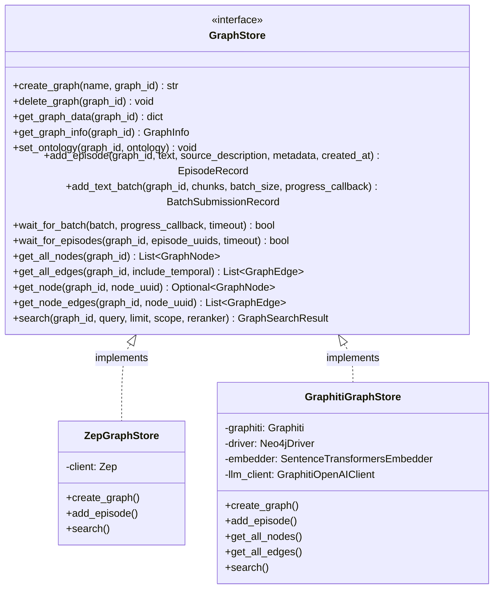
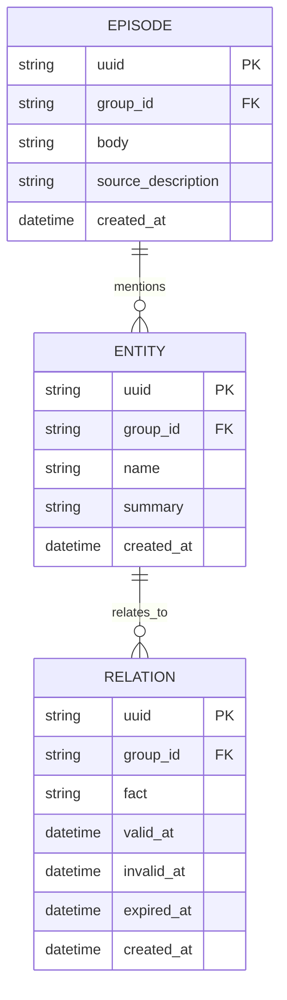
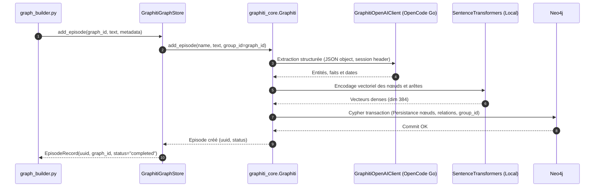

# Architecture technique — Epic 003 : GraphitiGraphStore

- **Statut** : validé
- **Date** : 8 octobre 2026
- **Contexte** : Implémentation de `GraphitiGraphStore`, connexion Neo4j en local et adaptation du chemin de lecture (ADR 0001, ADR 0003, Epic 002).

---

## 1. Vue d'ensemble et Clean Architecture

`GraphitiGraphStore` constitue la seconde implémentation concrète de l'interface abstraite `GraphStore` (créée lors de l'Epic 002).
Elle réside dans la couche `utils/` (`backend/app/utils/graph_store/graphiti_store.py`), préservant strictement la direction des dépendances :

```
app/api/  →  app/services/  →  app/utils/graph_store/
                                      ├── base.py (interface abstraite & DTOs neutres)
                                      ├── factory.py (sélection ZEP_BACKEND)
                                      ├── zep_store.py (implémentation Zep Cloud)
                                      └── graphiti_store.py (implémentation Graphiti + Neo4j)
```

Aucun service métier (`graph_builder.py`, `zep_entity_reader.py`, etc.) n'importe `graphiti_core`, `neo4j` ou `graphiti_store.py` directement. L'accès s'effectue exclusivement par le contrat `GraphStore` via la factory `get_graph_store()`.



---

## 2. Composants internes de `GraphitiGraphStore`

L'implémentation assemble les briques techniques éprouvées et validées lors de l'Epic 001 :

1. **Driver Neo4j** :
   - Connexion Bolt sur `neo4j://localhost:7687` (ou variable `NEO4J_URI`).
   - Authentification via `NEO4J_USER` (défaut : `neo4j`) et `NEO4J_PASSWORD`.
   - Driver initialisé avec l'override mesuré (`neo4j==5.26.x`).
2. **Client LLM (`GraphitiOpenAIClient`)** :
   - Défini dans `backend/app/utils/graphiti_llm_client.py`.
   - Injecte automatiquement l'en-tête `x-opencode-session` et le User-Agent pour respecter les exigences d'OpenCode Go.
   - Force le mode `structured_output_mode="json_object"` pour garantir un parsing JSON sans faille.
3. **Embedder local (`SentenceTransformersEmbedder`)** :
   - Défini dans `backend/app/utils/graphiti_embedder.py`.
   - Modèle `all-MiniLM-L6-v2` (dimensions 384) s'exécutant localement sans appel réseau ni coût marginal.
4. **Moteur `Graphiti`** :
   - Instance `graphiti_core.Graphiti` configurée avec le driver, le LLM client et l'embedder local.

---

## 3. Modèle de données et partitionnement Neo4j (`group_id`)

Dans une base Neo4j partagée, l'isolation étanche entre plusieurs graphes / simulations est assurée par la propriété **`group_id`** :

- **Règle fondamentale** : Chaque simulation ou projet correspond à un `graph_id` unique. Dans Neo4j, `group_id = graph_id`.
- **Nœuds entités** : Portent le label `:Entity`, avec les propriétés `{uuid, name, summary, group_id, created_at}`.
- **Arêtes / Relations** : Portent un type de fait (`:RELATION` ou prédicat typé), avec les propriétés `{uuid, fact, valid_at, invalid_at, expired_at, created_at, group_id}`.
- **Épisodes** : Portent le label `:Episode`, avec `{uuid, body, source_description, group_id, created_at}`.



---

## 4. Requêtes Cypher de lecture et parcours

Plutôt que de transiter par des abstractions lentes, les opérations de lecture ensembliste exploitent des requêtes Cypher paramétrées, hermétiques et ultra-rapides :

### 4.1 Récupération de tous les nœuds (`get_all_nodes`)

```cypher
MATCH (n:Entity)
WHERE n.group_id = $group_id
RETURN n.uuid AS uuid,
       n.name AS name,
       n.summary AS summary,
       labels(n) AS labels,
       n.created_at AS created_at,
       properties(n) AS attributes
```

### 4.2 Récupération de toutes les arêtes avec temporalité (`get_all_edges`)

```cypher
MATCH (source:Entity)-[r]->(target:Entity)
WHERE source.group_id = $group_id
  AND target.group_id = $group_id
RETURN r.uuid AS uuid,
       source.uuid AS source_uuid,
       target.uuid AS target_uuid,
       type(r) AS relation_type,
       r.fact AS fact,
       r.created_at AS created_at,
       r.valid_at AS valid_at,
       r.invalid_at AS invalid_at,
       r.expired_at AS expired_at,
       properties(r) AS attributes
```

### 4.3 Voisinage direct d'un nœud (`get_node_edges`)

```cypher
MATCH (n:Entity {uuid: $node_uuid, group_id: $group_id})-[r]-(neighbor:Entity {group_id: $group_id})
RETURN r.uuid AS uuid,
       startNode(r).uuid AS source_uuid,
       endNode(r).uuid AS target_uuid,
       type(r) AS relation_type,
       r.fact AS fact,
       r.created_at AS created_at,
       r.valid_at AS valid_at,
       r.invalid_at AS invalid_at,
       r.expired_at AS expired_at,
       properties(r) AS attributes
```

### 4.4 Suppression étanche d'un graphe (`delete_graph`)

```cypher
MATCH (n {group_id: $group_id})
DETACH DELETE n
```

---

## 5. Flux d'ingestion et d'écriture (Séquence)

L'ingestion d'un chunk de texte s'effectue de manière synchrone à travers Graphiti :



---

## 6. Adaptation du chemin de lecture (`zep_entity_reader.py`)

### 6.1 Le problème à résoudre (ADR 0003)

Historiquement, `zep_entity_reader.py:262` contenait la logique suivante :
```python
# Code historique couplé aux labels d'ontologie Zep
custom_labels = [l for l in labels if l not in ["Entity", "Node"]]
if not custom_labels:
    continue  # Rejette silencieusement tous les nœuds Graphiti !
```

### 6.2 La solution architecturale

Sans recourir à une ontologie dynamique (v2, ADR 0003), le lecteur d'entités doit traiter les nœuds Graphiti avec élégance :

1. Si le nœud porte des labels spécifiques (cas Zep ou ontologie custom future), ils sont utilisés comme types métier (`custom_labels`).
2. Si le nœud ne porte que le label `:Entity` (cas Graphiti v1), il **n'est pas rejeté**. Son type d'entité principal est déduit :
   - Depuis un attribut `type` ou `entity_type` dans les attributs du nœud,
   - Ou à défaut, typé sous la catégorie générique `"Entity"`,
   - Le moteur de persona utilise alors le `name` et le `summary` du nœud pour qualifier l'entité.

Cette adaptation rend le chemin de lecture totalement **agnostique du backend**, garantissant un fonctionnement identique avec Zep Cloud et Graphiti Local.
