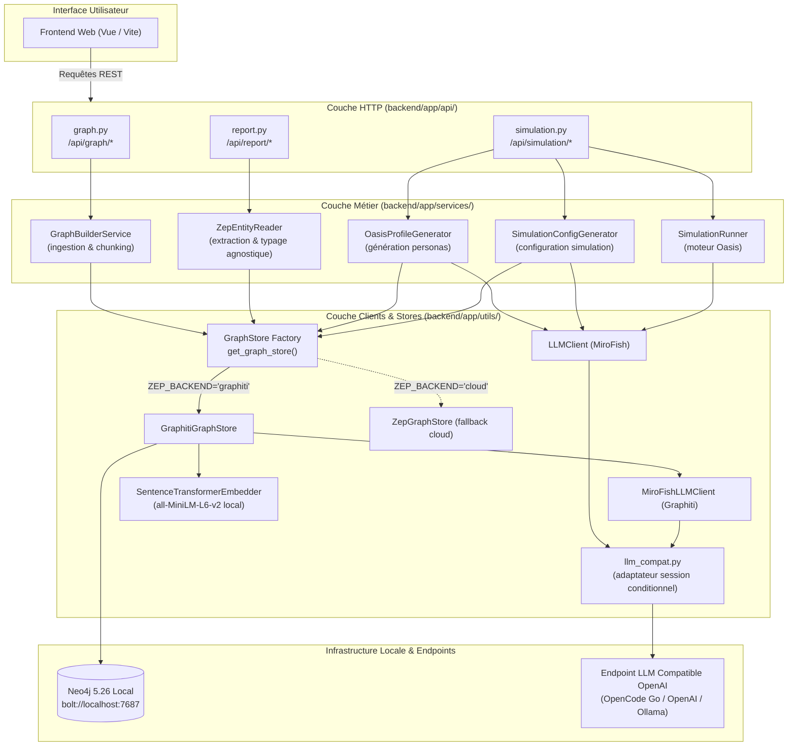
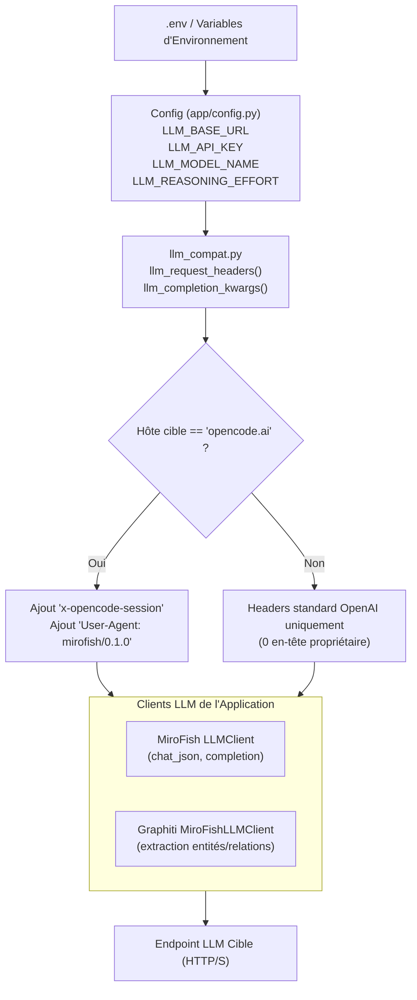
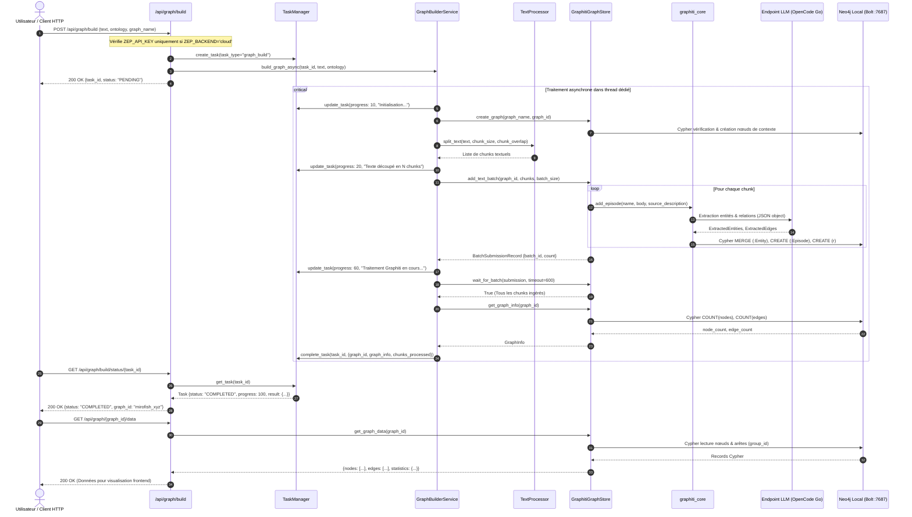
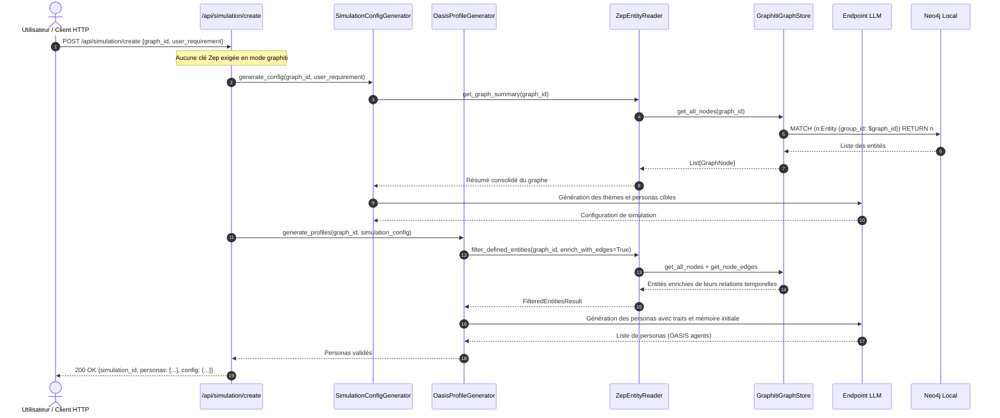

# Architecture technique — Epic 004 : Bascule sans Zep et configuration universelle

- **Statut** : validé
- **Date** : 9 octobre 2026
- **Contexte** : Levée définitive du prérequis `ZEP_API_KEY`, paramétrabilité universelle du LLM via `.env` et validation du pipeline local de bout en bout (ADR 0001, ADR 0004, Epic 003).

---

## 1. Vue d'ensemble de l'architecture locale-first

L'Epic 004 concrétise le fonctionnement de MiroFish en environnement 100 % local-first. L'accès au cloud Zep devient strictement optionnel, et le moteur s'adosse à deux piliers locaux :
1. **Magasin de graphe de connaissances** : `GraphitiGraphStore` adossé à l'instance Neo4j locale (`bolt://localhost:7687`), initialisée et partitionnée par `group_id = graph_id`.
2. **Fournisseur LLM universel** : Tout endpoint compatible OpenAI configuré dans `.env` (`LLM_BASE_URL`, `LLM_API_KEY`, `LLM_MODEL_NAME`, `LLM_REASONING_EFFORT`), avec adaptateur de session transparent pour OpenCode Go (`opencode.ai`) et neutralité absolue pour les autres fournisseurs.

---

## 2. Architecture de la configuration LLM universelle (`.env`)

### 2.1 Principes directeurs

1. **Agnosticisme de l'endpoint** : Le code ne présuppose aucun fournisseur en dur. L'URL de base (`LLM_BASE_URL`), la clé d'API (`LLM_API_KEY`) et le nom du modèle (`LLM_MODEL_NAME`) proviennent exclusivement de la configuration.
2. **Neutralité sélective d'hôte (ADR 0004)** :
   - Si `LLM_BASE_URL` cible `opencode.ai` : injection automatique de l'en-tête `x-opencode-session` et du `User-Agent: mirofish/0.1.0`.
   - Si `LLM_BASE_URL` cible un autre hôte (OpenAI officiel `api.openai.com`, Ollama local `localhost:11434`, vLLM, Groq, DeepSeek) : **aucun en-tête propriétaire n'est ajouté**.
3. **Prise en charge de l'effort de raisonnement** : Transmission transparente de `LLM_REASONING_EFFORT` si renseigné.
4. **Homogénéité absolue** : Le client LLM de MiroFish (`llm_client.py`) et le client LLM de Graphiti (`graphiti_llm_client.py`) partagent la même logique de résolution et de configuration.

---

## 3. Découplage de la clé `ZEP_API_KEY`

### 3.1 État initial (couplage rigide) vs État cible (découplage agnostique)

| Composant | Comportement initial | Comportement cible Epic 004 |
|---|---|---|
| `backend/app/config.py` | `Config.validate()` vérifie `ZEP_API_KEY` si `backend == 'cloud'` (déjà conditionné). | Reste conditionné à `ZEP_BACKEND == 'cloud'` ; `ZEP_BACKEND='graphiti'` devient le défaut recommandé en local. |
| `backend/app/api/graph.py` | 7 gardes `if not Config.ZEP_API_KEY: return 400` inconditionnels. | Les gardes ne s'appliquent **que si** `Config.ZEP_BACKEND == 'cloud'`. En mode `graphiti`, l'absence de clé Zep est nominale. |
| `backend/app/api/simulation.py` | 3 gardes `if not Config.ZEP_API_KEY: return 400` inconditionnels. | Les gardes ne s'appliquent **que si** `Config.ZEP_BACKEND == 'cloud'`. |
| `GraphBuilderService` | `__init__(api_key=Config.ZEP_API_KEY)` passé en dur. | `__init__(api_key=None, store=None)` : si `store` est None, délègue à `get_graph_store(api_key=...)`. |
| `ZepEntityReader` | `self.api_key = api_key or Config.ZEP_API_KEY`. | Délégation intégrale au `GraphStore` injecté ou résolu sans exigence de clé. |
| `OasisProfileGenerator` | `self.zep_api_key = zep_api_key or Config.ZEP_API_KEY`. | Clé Zep facultative en mode `graphiti`. |
| `ZepGraphMemoryManager` | `self.api_key = api_key or Config.ZEP_API_KEY`. | Clé Zep facultative en mode `graphiti`. |

---

## 4. Flux de construction de graphe local de bout en bout

Ce diagramme de séquence illustre le traitement complet d'un document brut jusqu'à sa matérialisation dans Neo4j local sans clé Zep :

---

## 5. Flux d'extraction, génération de personas et simulation

Ce flux valide que les consommateurs aval s'exécutent avec succès sur le graphe Graphiti réel :

---

## 6. Gestion des pannes et résilience locale

1. **Neo4j inaccessible** :
   - En cas d'échec de connexion Bolt au démarrage ou lors d'une requête, `GraphitiGraphStore` lève `GraphConnectionError`.
   - `GraphBuilderService` capture l'erreur et marque la tâche comme `TaskStatus.FAILED` avec un message clair (`Échec de connexion à la base Neo4j locale sur bolt://localhost:7687`).
2. **Endpoint LLM indisponible ou erreur d'authentification** :
   - Si `LLM_API_KEY` est invalide ou si l'endpoint répond par une erreur HTTP 4xx/5xx, `GraphStoreError` ou `LLMResponseError` est propagée.
   - Les retries exponentielles de Graphiti et de `llm_client.py` permettent d'encaisser les instabilités réseau passagères.
3. **Absence de régression Zep Cloud** :
   - Si un utilisateur active `ZEP_BACKEND='cloud'`, la présence de `ZEP_API_KEY` reste formellement contrôlée et le code emprunte le chemin `ZepGraphStore` sans aucune altération.

---

## 7. Stratégie de découpage en stories (Epic 004)

Pour garantir une progression disciplinée et vérifiable (AGENTS.md §2.8), l'Epic 004 est découpé en 5 stories autonomes :

| Story | Titre | Portée |
|---|---|---|
| **004-1** | Paramétrabilité universelle du LLM et consolidation de `llm_compat.py` | Support unifié de `LLM_BASE_URL`, `LLM_MODEL_NAME`, `LLM_API_KEY`, `LLM_REASONING_EFFORT`, tests d'isolation inter-fournisseurs. |
| **004-2** | Levée des gardes `ZEP_API_KEY` dans les routes API et services | Nettoyage des blocages `400` dans `api/graph.py`, `api/simulation.py`, `graph_builder.py`, `oasis_profile_generator.py`. |
| **004-3** | Ingestion et construction de graphe de bout en bout avec `GraphitiGraphStore` | Validation du pipeline `POST /api/graph/build` sur document représentatif avec stockage Neo4j et polling de statut. |
| **004-4** | Génération de personas et configuration de simulation sans clé Zep | Validation de la chaîne `simulation_config_generator` + `oasis_profile_generator` adossée au graphe local. |
| **004-5** | Banc de test de qualification local-first et clôture de l'Epic 004 | Script de démonstration de bout en bout sans clé Zep, validation des critères C1-C5, rapport d'évaluation et clôture. |
