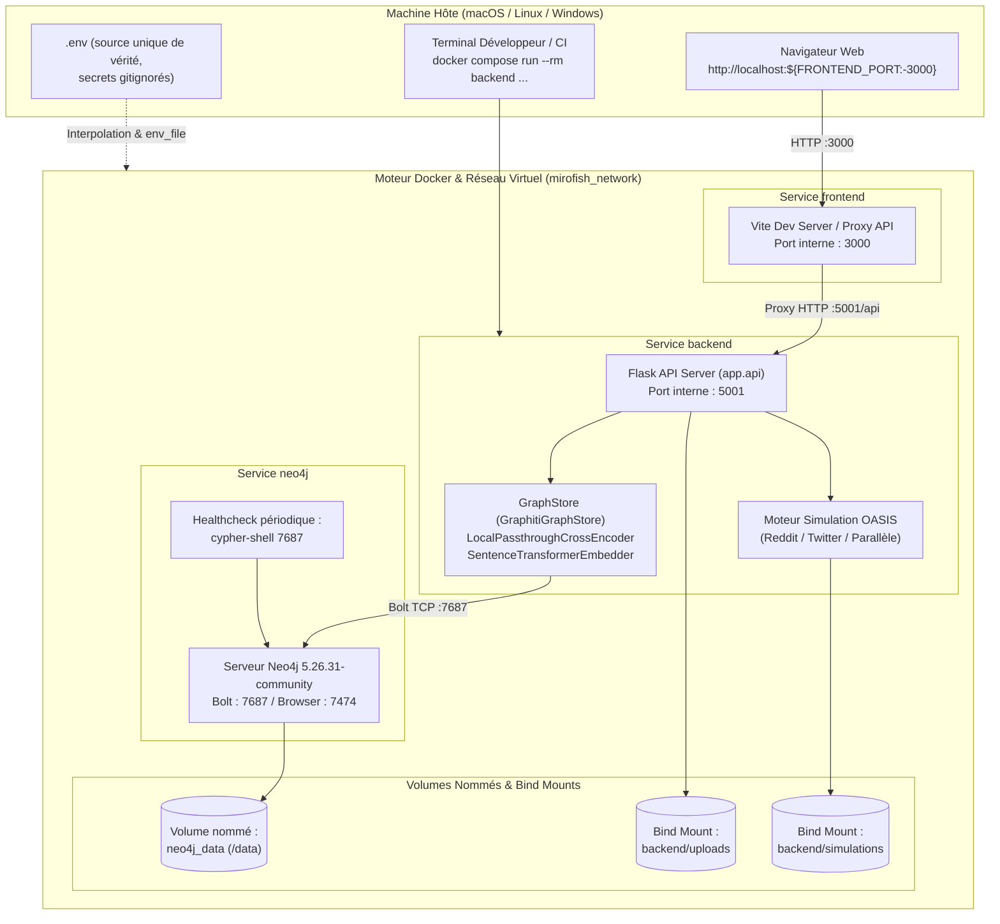
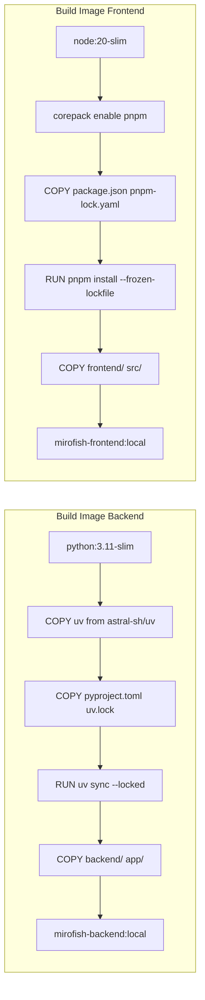
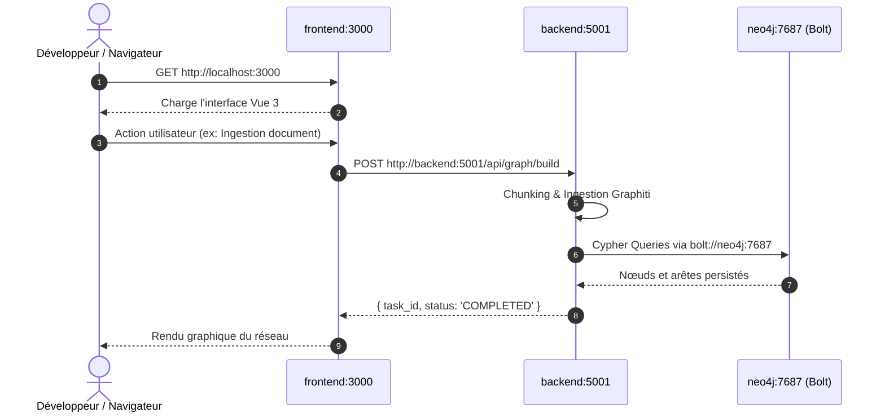
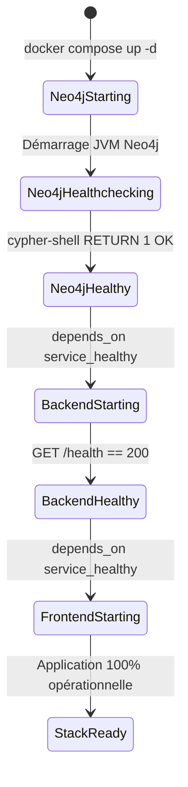

# Architecture technique — Epic 005 : Environnement Docker de référence (Docker-first)

- **Statut** : validé
- **Date** : 9 octobre 2026
- **Contexte** : Intégration complète et unifiée sous Docker (Neo4j, Backend Flask/Graphiti, Frontend Vue) selon l'ADR 0006 et la constitution AGENTS.md §2.9.

---

## 1. Vue d'ensemble de la topologie multi-services

L'architecture Docker-first vise à éliminer toute disparité entre l'environnement local de l'hôte et l'environnement d'exécution de référence.  
Elle structure MiroFish en trois services spécialisés, isolés et interconnectés via un réseau de pont virtuel dédié (`mirofish_network`) :

1. **`neo4j`** : Moteur de graphe local (édition Community 5.26.31). Persistance garantie par le volume nommé `neo4j_data`.
2. **`backend`** : Serveur Flask d'API REST, moteur d'ingestion `GraphBuilderService`, stockage `GraphitiGraphStore`, moteur d'agents et simulations OASIS (`camel-oasis`).
3. **`frontend`** : Interface web interactive Vue 3 / Vite, relayant les appels REST vers le service `backend`.



---

## 2. Découpage des conteneurs et stratégie de build

### 2.1 Séparation des responsabilités vs Monolithe amont

L'image amont (`Dockerfile` existant) mélangeait Python 3.11, Node.js, `npm`, `corepack` et `pnpm` dans un même conteneur, lançant `pnpm run dev` à la racine. Cette approche présente des inconvénients majeurs :
- Image très lourde (dépendances Python ML avec PyTorch + dépendances Node frontend).
- Impossibilité de redémarrer le backend sans couper le frontend.
- Concurrence sur les ressources processeur entre la compilation Vite et le traitement d'ingestion graphe.
- Difficulté d'isoler l'exécution des tests unitaires backend.

L'architecture Epic 005 adopte un **découpage propre multi-stage ou multi-Dockerfile** :
- **Backend Dockerfile** : basé sur `python:3.11-slim`, installe `uv` depuis l'image officielle Astral (`ghcr.io/astral-sh/uv:0.9.26`), synchronise les dépendances Python via `uv sync --locked`, expose le port 5001.
- **Frontend Dockerfile** : basé sur `node:20-slim`, active `pnpm` via corepack avec version fixée, installe les dépendances via `pnpm install --frozen-lockfile`, expose le port 3000 avec proxy configuré vers `backend:5001`.



### 2.2 Mise en cache optimale des couches

Pour garantir des builds ultra-rapides lors du développement :
1. Les fichiers de lock (`uv.lock`, `pyproject.toml`, `pnpm-lock.yaml`, `package.json`) sont copiés en premier.
2. L'installation des paquets est exécutée dans une couche distincte.
3. Le code source métier n'est copié qu'après. Toute modification de code Python ou Vue ne réinvalide pas la couche des dépendances.

---

## 3. Topologie réseau et résolution d'adresses

### 3.1 Résolution interne DNS Docker

Au sein du réseau `mirofish_network` :
- Le service `backend` résout l'hôte de base de données sous le nom **`neo4j`** :
  ```ini
  NEO4J_URI=bolt://neo4j:7687
  ```
- Le service `frontend` résout l'hôte de l'API sous le nom **`backend`** :
  ```javascript
  // proxy Vite ou configuration API
  target: 'http://backend:5001'
  ```

### 3.2 Accès depuis la machine hôte

Pour que le développeur puisse inspecter la base ou lancer des commandes directes depuis sa machine :
- Neo4j expose `7687:7687` (Bolt) et `7474:7474` (Navigateur Neo4j web).
- Backend expose `${FLASK_PORT:-5001}:5001`.
- Frontend expose `${FRONTEND_PORT:-3000}:3000`.



---

## 4. Persistance des données et cycle de vie des volumes

Conformément à l'ADR 0006 :
- Les données Neo4j résident dans le volume nommé **`neo4j_data`** (`/data`).
- `docker compose down` préserve le volume.
- Seul un `docker compose down -v` explicite purge le volume.

| Ressource | Type de stockage | Chemin conteneur | Cycle de vie |
|---|---|---|---|
| Graphe Neo4j | Volume nommé Docker (`neo4j_data`) | `/data` | Persistant (indépendant du conteneur) |
| Documents uploadés | Bind Mount (`./backend/uploads`) | `/app/backend/uploads` | Persistant sur le système de fichiers hôte |
| Fichiers de simulation | Bind Mount (`./backend/simulations`) | `/app/backend/simulations` | Persistant sur le système de fichiers hôte |
| Logs applicatifs | stdout / stderr | N/A | Gérés par le daemon Docker (`docker compose logs`) |

---

## 5. Ordonnancement, cycle de vie et Healthchecks

### 5.1 Dépendances conditionnelles

Le démarrage de l'application doit être strictement ordonnancé pour éviter toute erreur de connexion au bootstrap :
1. `neo4j` démarre.
2. Le healthcheck vérifie que le port Bolt 7687 répond et accepte les connexions via `cypher-shell`.
3. Dès que `neo4j` est `healthy`, le service `backend` démarre.
4. Dès que `backend` répond `HTTP 200` sur `/health`, le service `frontend` est prêt à router le trafic.



### 5.2 Définition des Healthchecks

- **Neo4j** :
  ```yaml
  test: ["CMD-SHELL", "cypher-shell -u neo4j -p \"$NEO4J_PASSWORD\" 'RETURN 1' >/dev/null 2>&1 || exit 1"]
  interval: 5s
  timeout: 5s
  retries: 10
  start_period: 15s
  ```
- **Backend** :
  ```yaml
  test: ["CMD-SHELL", "python -c 'import urllib.request; urllib.request.urlopen(\"http://localhost:5001/health\")' || exit 1"]
  interval: 5s
  timeout: 3s
  retries: 5
  start_period: 5s
  ```

---

## 6. Exécution des tests et outillage CLI dans le conteneur

L'environnement de référence permet d'exécuter l'intégralité du banc de tests sans installer Python ni Node sur la machine hôte :

```bash
# Lancement de l'intégralité des 632 tests
docker compose run --rm backend uv run pytest tests/ -q

# Lancement du linter
docker compose run --rm backend uv run ruff check .

# Lancement de la validation des plans
docker compose run --rm backend uv run python scripts/validate_plans.py

# Exécution du banc de qualification globale local-first
docker compose run --rm backend uv run python scripts/verifier_qualification_local_first.py
```

Le conteneur de test partage le réseau `mirofish_network` et peut donc interagir directement avec le service `neo4j` réel sans aucun composant tiers.

---

## 7. Gestion de la sécurité et des secrets

Conformément à la constitution ([`AGENTS.md`](file:///Users/simon/dev/MiroFish/AGENTS.md) §2.4) :
1. **Zéro secret copié** : Le fichier `.env` figure obligatoirement dans `.dockerignore`. Aucune directive `COPY .env` n'existe dans les Dockerfiles.
2. **Injection par `env_file`** : Docker Compose injecte les variables sensibles à l'exécution (`NEO4J_PASSWORD`, `LLM_API_KEY`).
3. **Moindre privilège** : Neo4j ne reçoit que son identifiant et mot de passe (`NEO4J_AUTH`), sans exposer les clés LLM inutiles à la base de données.
