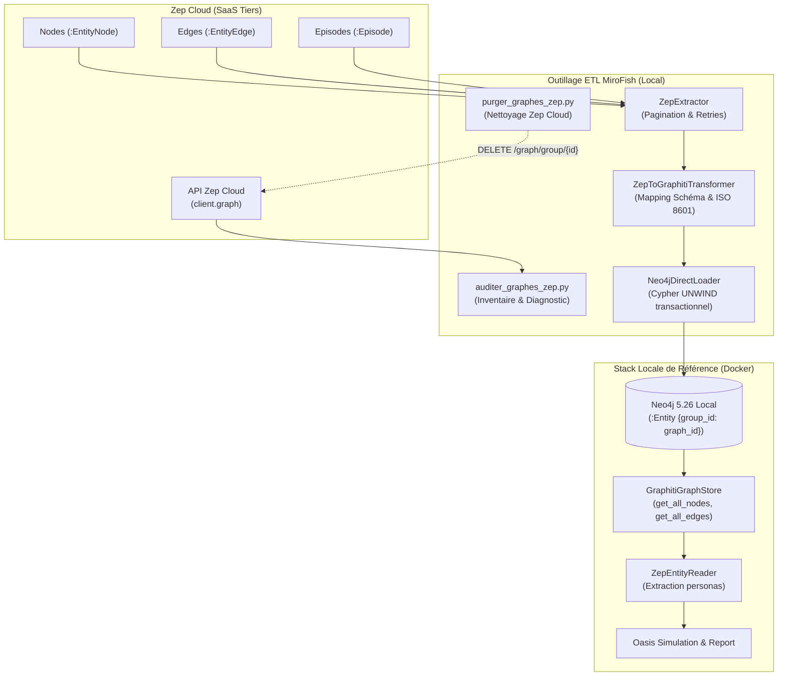
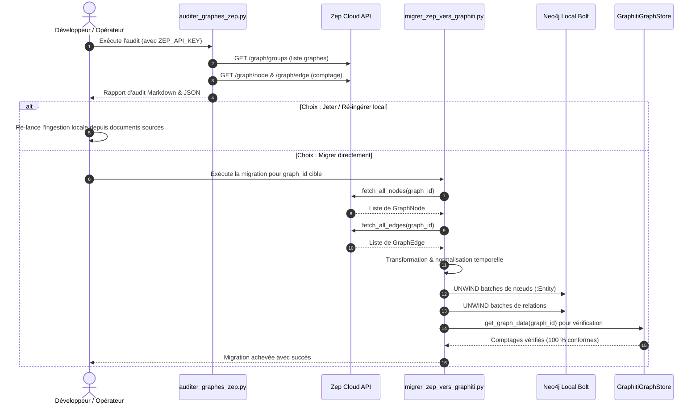
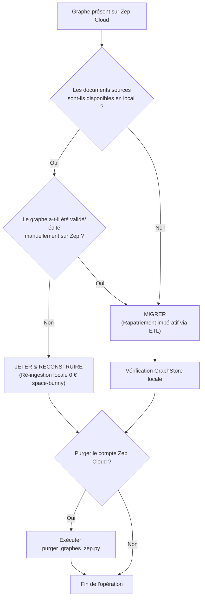

# Architecture — Epic 006 : Migrer un graphe Zep existant — ou acter qu'on jette

- **Statut** : `backlog` · **Dépend de** : 003, 004, 005 · **Bloque** : aucun
- **Référence PRD** : [`prd.md`](prd.md)

---

## 1. Vue d'ensemble de l'architecture de migration

L'architecture de l'Epic 006 assure le diagnostic, l'arbitrage et le rapatriement direct des graphes hébergés sur Zep Cloud vers l'instance Neo4j locale sans coût d'inférence LLM :



---

## 2. Modélisation comparée et mapping de schéma

### 2.1 Schéma Zep Cloud vs Schéma Neo4j Graphiti

| Entité / Champ | Zep Cloud (Source) | Neo4j Local / Graphiti (Cible) | Règles de transformation |
|---|---|---|---|
| **Partitionnement** | `group_id` | `n.group_id = target_graph_id` | Préservé strictement à l'identique. |
| **Identifiant Nœud** | `uuid` (str) | `n.uuid` (str) | Conservé ou généré de manière déterministe. |
| **Nom du Nœud** | `name` (str) | `n.name` (str) | Copie directe. |
| **Résumé Nœud** | `summary` (str) | `n.summary` (str) | Copie directe (`""` si absent). |
| **Labels Nœud** | `labels` (list[str]) | `:Entity` + labels normalisés | Label de base `:Entity` imposé pour compatibilité Graphiti. |
| **Attributs Nœud** | `attributes` (dict) | Propriétés Cypher | `entity_type` préservé comme propriété prioritaire pour `ZepEntityReader`. |
| **Identifiant Arête** | `uuid` (str) | `r.uuid` (str) | Conservé à l'identique. |
| **Source / Cible** | `source_node_uuid`, `target_node_uuid` | `(source:Entity)-[r]->(target:Entity)` | Jointure sur `uuid` et `group_id`. |
| **Nom Relation** | `name` (str) | `r.name` (str) | Copie directe. |
| **Type Relation** | `type` (str) ou `name` | Type Cypher `[r:RELATES_TO]` ou typé | Normalisé en majuscules snake_case si typé, sinon `RELATES_TO`. |
| **Fait sémantique** | `fact` (str) | `r.fact` (str) | Copie directe du texte du fait. |
| **Type de fait** | `fact_type` (str) | `r.fact_type` (str) | Copie directe (`r.name` en repli). |
| **Temporalité** | `valid_at`, `invalid_at`, `expired_at` | `r.valid_at`, `r.invalid_at`, `r.expired_at` | Format ISO 8601 UTC normalisé (`YYYY-MM-DDTHH:MM:SSZ`). |

---

## 3. Pipeline ETL et flux de traitement



### 3.1 Stratégie d'insertion Cypher par lots (`UNWIND`)

Pour garantir des performances optimales et l'idempotence sans saturer la mémoire :

1. **Création des nœuds** :
   ```cypher
   UNWIND $nodes AS row
   MERGE (n:Entity {uuid: row.uuid, group_id: $group_id})
   SET n.name = row.name,
       n.summary = row.summary,
       n.created_at = row.created_at,
       n += row.attributes
   ```

2. **Création des arêtes** :
   ```cypher
   UNWIND $edges AS row
   MATCH (source:Entity {uuid: row.source_node_uuid, group_id: $group_id})
   MATCH (target:Entity {uuid: row.target_node_uuid, group_id: $group_id})
   MERGE (source)-[r:RELATES_TO {uuid: row.uuid}]->(target)
   SET r.name = row.name,
       r.fact = row.fact,
       r.fact_type = row.fact_type,
       r.created_at = row.created_at,
       r.valid_at = row.valid_at,
       r.invalid_at = row.invalid_at,
       r.expired_at = row.expired_at,
       r += row.attributes
   ```

---

## 4. Arbre de décision formel « Migrer vs Jeter »



---

## 5. Matrice des composants modifiés / ajoutés

| Composant | Fichier | Type | Rôle |
|---|---|---|---|
| **Audit Zep** | `backend/scripts/auditer_graphes_zep.py` | Création | Sonde autonome d'inventaire des graphes Zep Cloud. |
| **ETL Migration** | `backend/scripts/migrer_zep_vers_graphiti.py` | Création | Script d'extraction, conversion et chargement direct Cypher. |
| **Purge Zep** | `backend/scripts/purger_graphes_zep.py` | Création | Script de suppression confirmée des graphes sur Zep Cloud. |
| **Service Migration** | `backend/app/services/migration_service.py` | Création | Logique métier de mapping et d'orchestration ETL réutilisable. |
| **Tests d'Audit & ETL** | `backend/tests/test_migration_zep.py` | Création | Suite de tests unitaires hermétiques avec mocks Zep et Neo4j. |

---

## 6. Stratégie de test et hermétisme

1. **Tests unitaires hermétiques (`test_migration_zep.py`)** :
   - Mocker le client `zep_cloud` et les réponses paginées de `fetch_all_nodes` et `fetch_all_edges`.
   - Mocker la session du driver Neo4j pour valider les requêtes Cypher `UNWIND` générées.
   - Valider la préservation rigoureuse des champs temporels et des attributs.
   - 0 appel réseau externe, 0 clé API réelle requise en CI.
2. **Test comportemental réel (hors CI)** :
   - Capacité à exécuter `migrer_zep_vers_graphiti.py` contre l'instance Neo4j locale issue de Docker compose (`bolt://localhost:7687`).
