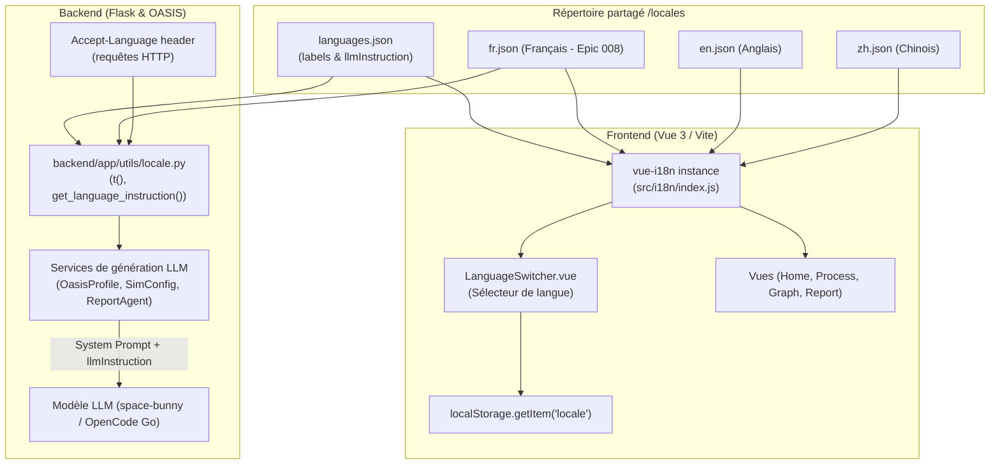
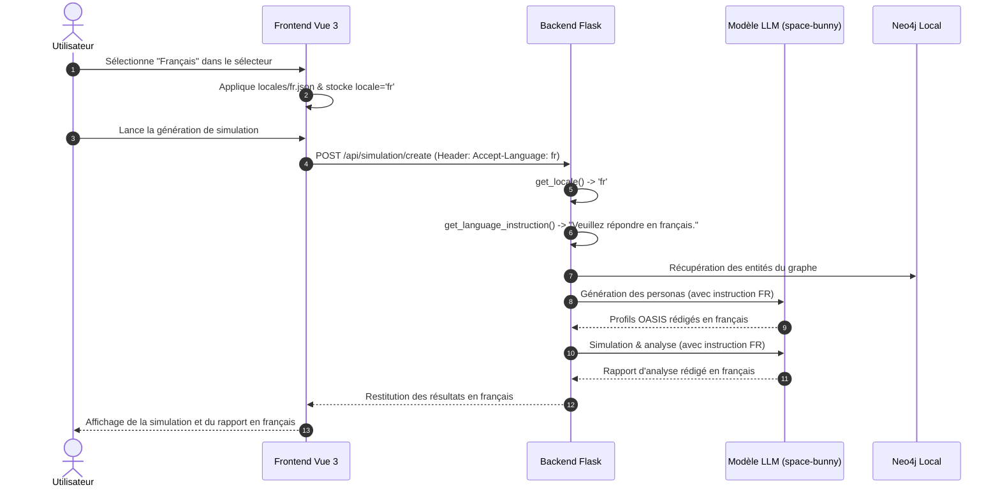

# Architecture — Epic 008 : Support complet de la langue française

- **Statut** : `backlog` · **Dépend de** : 005 · **Bloque** : aucun
- **Référence PRD** : [`prd.md`](prd.md)

---

## 1. Vue d'ensemble de l'architecture i18n

L'architecture de localisation de MiroFish repose sur un répertoire partagé racine [`locales/`](../../locales/) consommé conjointement par le frontend (Vue 3 / Vue I18n) et par le backend (Flask API / Agents LLM) :



---

## 2. Flux de données et cycle de vie de la localisation

### 2.1 Flux Frontend (Vue 3)

1. **Découverte dynamique** :
   Dans [`frontend/src/i18n/index.js`](../../frontend/src/i18n/index.js) :
   ```javascript
   const localeFiles = import.meta.glob('../../../locales/!(languages).json', { eager: true })
   ```
   L'ajout de `fr.json` dans `locales/` est immédiatement détecté sans nécessiter de modification manuelle de la liste des imports.
2. **Peuplement du sélecteur** :
   Pour chaque fichier présent dans `localeFiles`, la clé (ex: `fr`) est vérifiée dans `languages.json`. Si elle existe, l'option `{ key: 'fr', label: 'Français' }` est injectée dans `availableLocales`.
3. **Persistance et réactivité** :
   Le changement de langue met à jour `i18n.global.locale.value`, stocke le choix dans `localStorage.setItem('locale', 'fr')`, et configure l'en-tête par défaut `axios.defaults.headers.common['Accept-Language'] = 'fr'`.

### 2.2 Flux Backend & Prompts LLM

1. **Résolution du Locale** :
   [`backend/app/utils/locale.py`](../../backend/app/utils/locale.py) résout la langue courante :
   - Requête HTTP : lecture du header `Accept-Language` (ex: `fr`).
   - Tâche de fond asynchrone : lecture de `_thread_local.locale` initialisé au lancement du thread.
2. **Injection dans les Prompts Système** :
   La fonction `get_language_instruction()` retourne :
   `"Veuillez répondre en français."`
   Cette consigne est ajoutée aux prompts de :
   - `oasis_profile_generator.py` : génération des bios, centres d'intérêt et styles des personas.
   - `simulation_config_generator.py` : formulation des thèmes, événements d'actualité et posts initiaux.
   - `report_agent.py` : rédaction du rapport de synthèse post-simulation.



---

## 3. Matrice des composants modifiés / ajoutés

| Composant | Fichier | Type | Rôle |
|---|---|---|---|
| **Dictionnaire FR** | `locales/fr.json` | Création | ~668 clés traduites fidèlement depuis `en.json`. |
| **I18n Frontend** | `frontend/src/i18n/index.js` | Configuration | Support du fallback et de la détection de langue initiale. |
| **Composants Vues** | `frontend/src/views/*.vue` | Adaptation | Remplacement des dates codées en dur par le format `fr-FR`. |
| **Sélecteur de langue** | `frontend/src/components/LanguageSwitcher.vue` | Validation | Vérification de l'affichage de l'option "Français". |
| **Tests d'intégrité** | `backend/tests/test_i18n_parity.py` | Création | Validation automatique de la parité stricte des clés i18n. |

---

## 4. Stratégie de test et validation

1. **Test unitaire de parité structurelle (`test_i18n_parity.py`)** :
   - Vérifie que chaque clé présente dans `en.json` est obligatoirement présente dans `fr.json`.
   - Vérifie que chaque clé présente dans `fr.json` existe dans `en.json` (zéro clé orpheline).
   - Vérifie que `languages.json` déclare bien l'entrée `fr` avec `label` et `llmInstruction`.
2. **Test de rendu frontend** :
   - Vérification du chargement de l'IHM avec la langue française activée.
3. **Test de génération de simulation** :
   - Vérification de la présence de texte français dans les sorties générées par les agents LLM.
